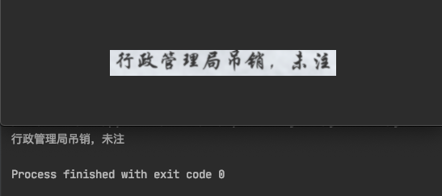

**如果本项目对你训练 OCR(光学文字识别)的识别部分模型有帮助 欢迎Start...**
## 环境

- `pip install -r requirements.txt`

- 自行手动安装`pillow, numpy, tqdm`

## 快速开始

#### 在文件`generator.py`文件中

##### 1. 生成器参数列表

```python
Parameter_list = {"background_path": "Project_doc/background/",  # 生成数据的背景路径
                  "image_width": 280,  # 生成图片的宽
                  "image_height": 32,  # 生成图片的高
                  "font_path": "Project_doc/font/",  # 字体文件路径
                  "corpus_path": "Project_doc/info.txt",  # 语料库路径, 用于生成数据的文本语料库
                  "dict_path": "Project_doc/dict.txt",  # 字典路径
                  "len_word": 10,  # 生成词长度
                  "output_label_path": "train_data.txt",  # 输出label文件
                  "output_data_path": "train_data_img/",  # 输出data路径
                  }
```

##### 2. 创建以下对象用于查看生成的效果

```python
if __name__ == '__main__':
  # 生成一张图片看效果
  gen_data = Generator_img(Parameter_list)
  gen_data.show_generate_data()
```



##### 3. 创建以下对象用于保存生成数据到本地

```python
if __name__ == '__main__':
    # 保存训练数据到本地
    save = Save_train_data(Parameter_list)
    save.gen_and_save_data(save_num=10)  # save num 保存的数量
```

[参考项目中文件夹](./Project_doc/example)

##### 4. 创建以下对象用于创建一个数据生成器,直接对接模型即可开始训练

```python
if __name__ == '__main__':
    # 创建一个生成器 可直接对接模型
    gen_loader = Generate_train(Parameter_list)
    loader = gen_loader.batch_generator(batch_size=128, max_label_len=10)
```

